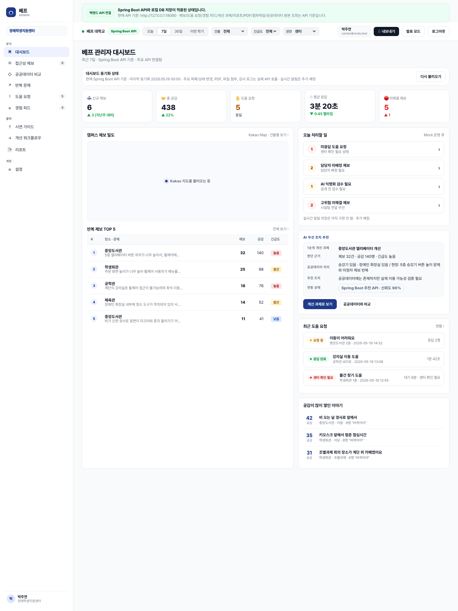
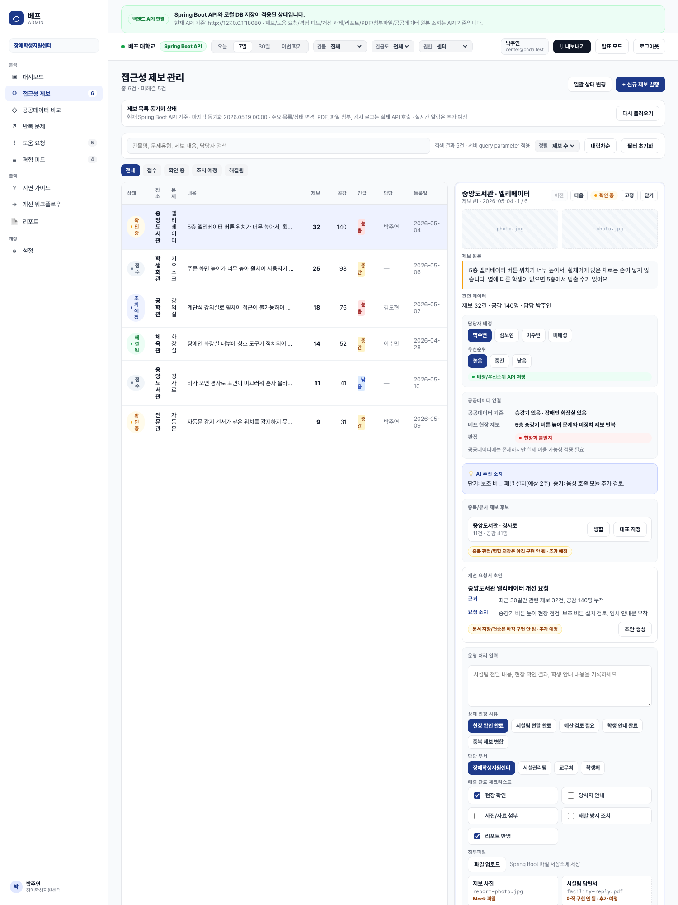
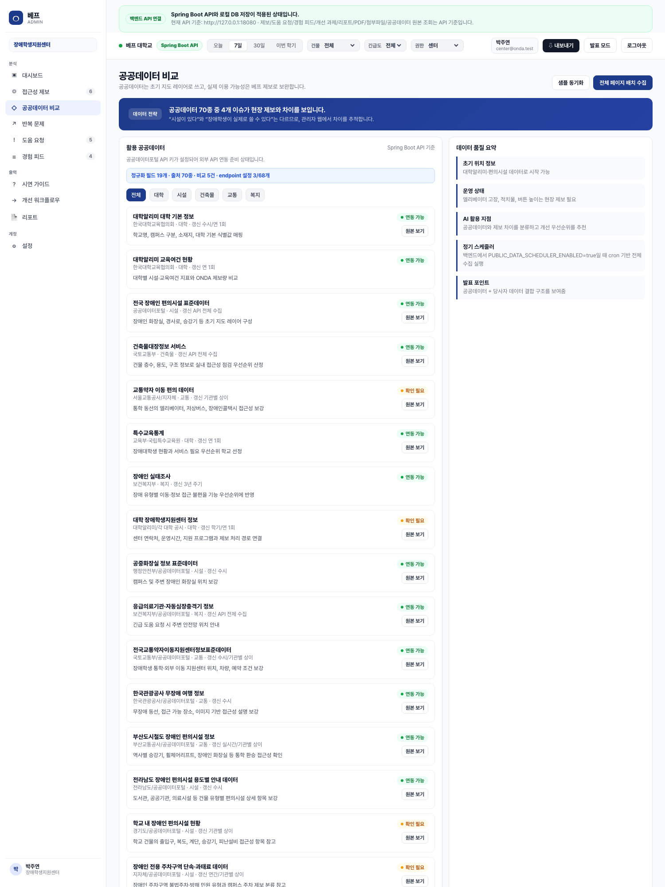
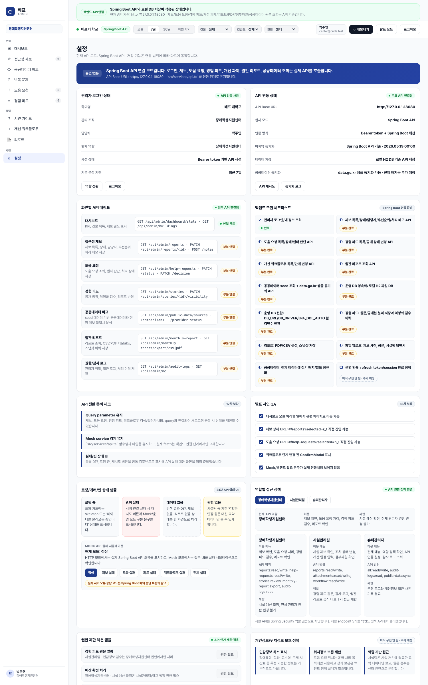
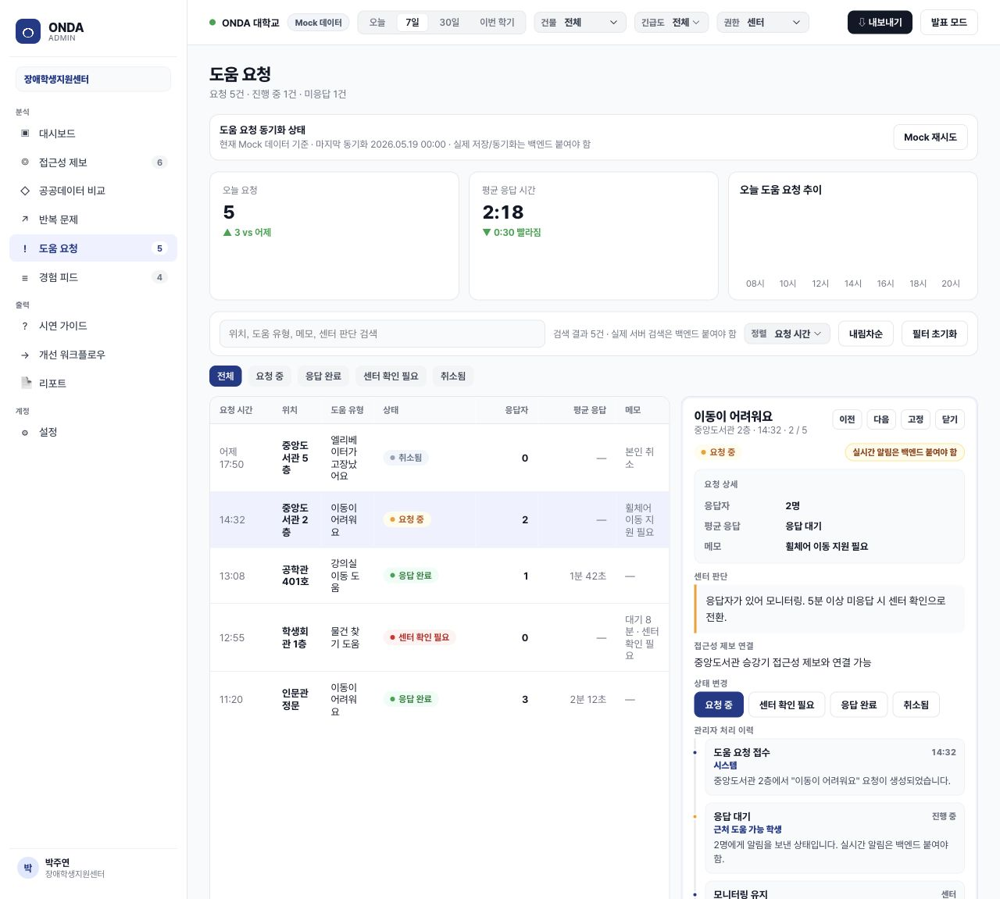
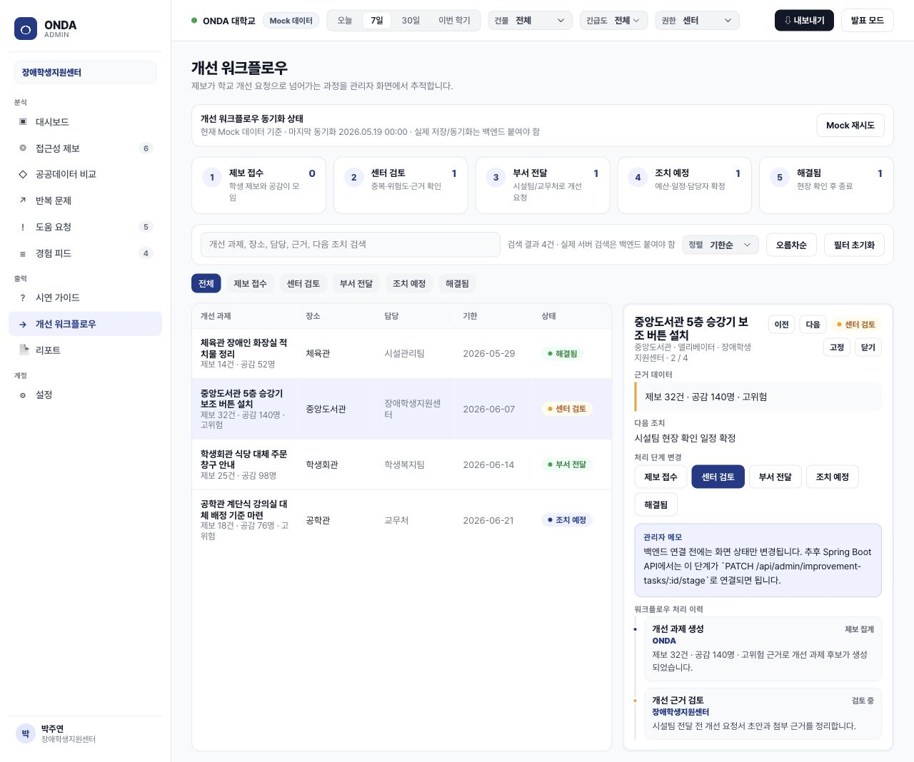
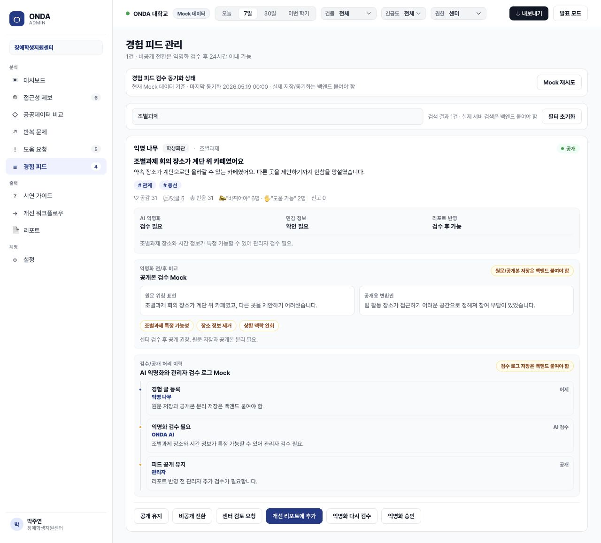
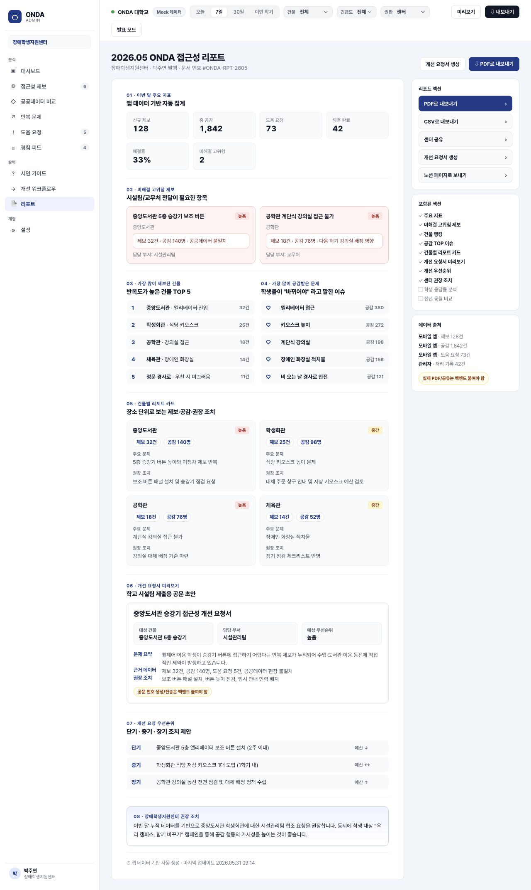
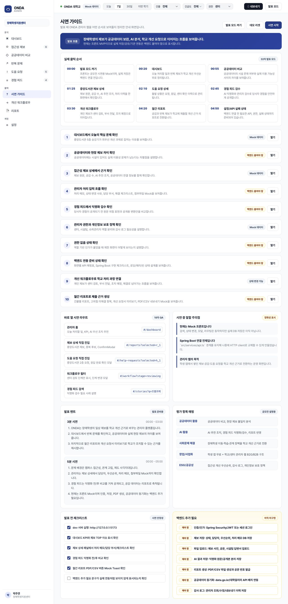

# 베프 Admin Web

베프 관리자 웹은 장애대학생의 접근성 제보, 도움 요청, 경험 피드, 공공데이터 참고 정보를 학교/장애학생지원센터가 확인하고 개선 우선순위를 검토할 수 있게 만든 공모전 시연용 React 대시보드입니다. AI와 공공데이터는 최종 판단이 아니라 관리자 결정을 돕는 보조 근거입니다.

> 현재 버전은 프론트엔드 MVP에 Spring Boot API 주요 기능을 연결한 상태입니다. 연결된 기능은 화면에서 `Spring Boot API` 또는 `API 저장`으로 표시하고, 아직 구현하지 않은 기능은 `아직 구현 안 됨 · 추가 예정`으로 분리했습니다.

## 베프는 어떤 프로그램인가요?

베프는 장애대학생이 캠퍼스에서 겪는 이동·학습·생활 불편을 학교가 놓치지 않고 처리하도록 돕는 접근성 운영 플랫폼입니다. 학생 앱에서 모인 제보, 공감, 도움 요청, 경험 피드를 관리자 웹에서 확인하고, 학교 담당자가 개선 과제로 배정하거나 월간 리포트로 정리할 수 있게 설계했습니다.

관리자 웹은 단순 게시판이 아니라 `제보 접수 -> 위험도 검토 -> 담당자 배정 -> 개선 워크플로우 -> 리포트 내보내기` 흐름을 하나로 묶는 업무 도구입니다. 공공데이터는 시설이 “있다/없다”를 단정하는 근거가 아니라, 현장 제보와 비교해 관리자 확인이 필요한 지점을 찾는 참고 레이어로 사용합니다.

### 핵심 사용자

| 사용자 | 필요한 일 |
|---|---|
| 장애학생지원센터 | 제보와 도움 요청을 확인하고, 민감한 경험 피드를 검수하며, 학교 개선 과제를 정리 |
| 시설관리팀 | 시설 관련 제보를 확인하고, 조치 상태와 개선 일정을 관리 |
| 학교 관리자 | 반복 문제, 공공데이터 차이, 월간 리포트를 보고 예산·개선 우선순위 검토 |

### 주요 기능

| 기능 | 설명 |
|---|---|
| 접근성 제보 관리 | 건물별 문제, 위험도, 공감 수, 담당자, 처리 메모를 관리 |
| 도움 요청 처리 | 실시간 도움 요청을 센터 판단과 접근성 제보 후보로 연결 |
| 경험 피드 검수 | 장애학생이 특정될 수 있는 표현을 줄이고 공개 상태를 관리 |
| 공공데이터 참고 | 70개 후보 데이터와 현장 제보를 비교해 확인이 필요한 지점을 표시 |
| 개선 워크플로우 | 제보를 검토, 부서 전달, 조치 예정, 해결 단계로 관리 |
| 월간 리포트 | PDF/CSV 리포트와 스냅샷으로 학교 제출용 근거를 정리 |
| 권한/감사 로그 | 역할별 정책과 제한 API, 관리자 활동 로그를 확인 |

## 현재 상태

| 구분 | 상태 |
|---|---|
| 대상 | 학교/장애학생지원센터 관리자 웹 |
| 구현 범위 | React + Vite 프론트엔드 |
| 데이터 | 기본은 `src/data/mockData.ts` Mock 데이터, HTTP 모드는 Spring Boot API |
| API 계층 | `src/services/api.ts`에서 Mock/API 모드 분기 |
| 백엔드 | Spring Boot API 주요 조회/저장/다운로드/권한 정책 기능 연결 가능 |
| 배포/시연 | 프론트는 로컬 또는 정적 호스팅 가능, 백엔드는 별도 Java 서버 필요 |

## 제출용 요약

| 문서 | 내용 |
|---|---|
| [`docs/SUBMISSION_SUMMARY.md`](docs/SUBMISSION_SUMMARY.md) | 구현 범위, 시연 흐름, 공공데이터 상태, 배포 주의 |
| [`docs/DEMO_CHECKLIST.md`](docs/DEMO_CHECKLIST.md) | 공모전 5분 시연 순서와 발표 멘트 |
| [`docs/DEMO_FAILURE_PLAN.md`](docs/DEMO_FAILURE_PLAN.md) | 백엔드/API/인터넷 문제 시 시연 대체 플랜 |
| [`docs/GITHUB_UPLOAD_CHECKLIST.md`](docs/GITHUB_UPLOAD_CHECKLIST.md) | GitHub 업로드 전 확인 사항 |
| [`docs/PRESENTATION_STATUS_TABLE.md`](docs/PRESENTATION_STATUS_TABLE.md) | PPT에 넣을 구현 상태 표 |

## 구현/Mock/추가 예정 구분

| 구분 | 내용 |
|---|---|
| 실제 API 연결 | 로그인, 내 정보, KPI, 제보 처리, 도움 요청, 경험 피드, 워크플로우, 리포트 PDF/CSV, 공공데이터 수집/원본/정규화, 권한 정책, 감사 로그 |
| Mock 또는 규칙 기반 | 발표 모드, 일부 안내 Toast, 특정 가능성 방지용 규칙 기반 익명화/관리자 검토용 추천 |
| 추가 예정 | 실제 외부 LLM, 운영 DB 전환, 메뉴/버튼 단위 권한 고도화, 외부 기관 자동 전송, 실시간 알림 |

## 기술 스택

| 영역 | 기술 |
|---|---|
| Frontend | React, TypeScript, Vite |
| Routing | React Router HashRouter |
| State | React local state |
| Data Layer | Mock/API service layer |
| Styling | CSS |
| Backend | Spring Boot, JPA, H2 파일 DB, 추후 PostgreSQL/MySQL/Oracle 전환 |

## 포트폴리오 관점

이 프로젝트는 단순 관리자 템플릿이 아니라, 장애학생 앱에서 발생하는 제보·공감·도움 요청·경험 피드가 학교의 개선 업무로 전환되는 흐름을 관리자 웹으로 구현한 프론트엔드 포트폴리오입니다.

| 관점 | 보여주는 역량 |
|---|---|
| 프론트엔드 구조 | 라우팅, 상세 패널, 검색/필터, URL query 상태, 로딩/빈/에러 상태 |
| 운영 UX | 담당자 배정, 위험도 우선 검토, 처리 이력, 확인 모달, 권한별 미리보기 |
| 백엔드 협업 | `src/services/api.ts`를 경계로 Mock과 향후 Spring Boot API를 분리 |
| 데이터 사고 | 제보, 도움 요청, 경험 피드, 공공데이터, 개선 워크플로우를 도메인별로 분리 |
| 정확성 | 실제 API 미연동 상태와 Mock 기능을 화면·문서에서 명확히 표시 |

## 내가 맡은 역할

| 역할 | 수행 내용 |
|---|---|
| 프론트엔드 구현 | 관리자 웹 전체 화면, 라우팅, 상태 UI, 상세 패널, 발표 모드 구현 |
| UI/UX 설계 | 학교/장애학생지원센터 관리자가 실제로 확인해야 할 운영 지표와 처리 흐름 설계 |
| API 전환 설계 | Mock service 구조, Query 타입, 백엔드 endpoint 후보, 화면/API 매핑 문서화 |
| QA/문서화 | 빌드 검증, 브라우저 확인, 발표자료용 캡처, README와 backend handoff 문서 정리 |

## 문제 정의

베프의 학생 앱이 장애학생의 경험과 제보를 모으는 서비스라면, 관리자 웹은 그 데이터를 학교가 실제 개선 업무로 처리할 수 있게 만드는 운영 도구입니다.

현재 기획의 핵심 문제는 다음과 같습니다.

- 학생의 불편 제보가 단순 게시글로 흩어지면 학교 개선 근거로 쓰기 어렵습니다.
- 도움 요청이나 경험 피드는 소수자인 장애학생이 수업·건물·상황만으로 특정될 수 있어 관리자 검수와 권한 분리가 필요합니다.
- 공공데이터만으로는 실제 캠퍼스의 고장, 물건 적치, 일시적 접근 불가 상황을 알기 어렵고, 핵심 판단 근거로 쓰기에는 한계가 있습니다.
- 공모전 시연에서는 앱 기능뿐 아니라 학교가 돈을 내고 쓸 수 있는 관리자 도구가 보여야 사업화 설득력이 생깁니다.

그래서 관리자 웹은 `제보 확인 -> 위험도 우선 검토 -> 담당자 배정 -> 개선 과제화 -> 리포트화` 흐름을 중심으로 설계했습니다. 반복 제보와 공감 수는 중요한 보조 지표지만, 고위험 제보를 제외하는 기준으로 사용하지 않습니다.

## 기술 선택 이유

| 선택 | 이유 |
|---|---|
| React + Vite | 공모전 MVP에서 빠르게 화면을 만들고 정적 배포하기 좋습니다. |
| TypeScript | 제보/도움 요청/피드/워크플로우 타입을 명확히 나눠 백엔드 DTO와 맞추기 쉽습니다. |
| HashRouter | 정적 호스팅 환경에서도 새로고침 라우팅 문제가 적어 시연 안정성이 좋습니다. |
| Mock/API service layer | 백엔드 없이도 발표 가능한 화면을 유지하면서, HTTP 모드에서는 같은 함수 시그니처로 Spring Boot API를 호출합니다. |
| CSS 기반 스타일 | 기존 디자인 톤을 유지하면서 과한 UI 프레임워크 의존성을 피했습니다. |

## 화면 미리보기

| 대시보드 | 접근성 제보 상세 |
|---|---|
|  |  |

| 공공데이터 참고 레이어 | 권한 정책 설정 |
|---|---|
|  |  |

| 도움 요청 | 개선 워크플로우 |
|---|---|
|  |  |

| 경험 피드 검수 | 월간 리포트 |
|---|---|
|  |  |

시연 가이드는 발표 순서와 평가 항목 매핑을 확인하는 보조 화면입니다.



## 주요 화면

| 경로 | 설명 |
|---|---|
| `#/dashboard` | 전체 KPI, 제보 밀도, 관리자 검토용 추천 |
| `#/reports` | 접근성 제보 목록, 상세 보기, 담당자/우선순위/처리 메모 API 저장 |
| `#/public-data` | 공공데이터 참고 레이어, 원본/정규화/지도 레이어 한계 확인 |
| `#/analysis` | 반복 문제 분석, 관리자 검토용 추천 |
| `#/help-requests` | 긴급 도움 요청 목록, 상세 패널, 센터 판단, 처리 이력 |
| `#/stories` | 장애학생 경험 피드 관리, 특정 가능성 방지용 익명화/검수 상태 |
| `#/workflow` | 개선 과제 처리 단계 관리 |
| `#/monthly-report` | 월간 접근성 리포트, PDF/CSV 내보내기, 리포트 스냅샷 |
| `#/demo-guide` | 공모전 발표용 시연 순서, 3분/5분 발표 멘트 |
| `#/settings` | 구현 상태표, 권한 정책, API 매핑, 아직 구현 안 된 기능 목록 |

## 실행 방법

```bash
npm install
npm run dev -- --host 127.0.0.1
```

로컬 실행 주소:

```text
http://127.0.0.1:5173/#/dashboard
```

## 빌드 방법

```bash
npm run build
```

## 환경변수

기본 시연은 `.env` 없이 Mock 모드로 동작합니다. Spring Boot 백엔드와 연결하려면 `.env`를 만들고 아래처럼 설정합니다.

```text
VITE_API_BASE_URL=http://127.0.0.1:18080
VITE_API_MODE=mock
```

실제 백엔드 연결 모드:

```text
VITE_API_BASE_URL=http://127.0.0.1:18080
VITE_API_MODE=http
VITE_DEMO_AUTO_LOGIN=true
VITE_DEMO_ADMIN_PASSWORD=onda1234!
```

`VITE_DEMO_AUTO_LOGIN=true`는 공모전 시연 편의 기능입니다. Spring Boot 서버 재시작으로 메모리 토큰이 사라졌을 때 seed 관리자 계정으로 한 번 자동 재로그인합니다. 실제 운영에서는 `false`로 끄고 refresh token/session 정책을 별도로 구현해야 합니다.

주의: 실제 `.env`, API Key, Token은 GitHub에 올리지 않습니다.

## 구현 포인트

- `src/services/api.ts`를 데이터 접근 경계로 두어 Mock 모드와 Spring Boot API 연결 모드를 분리했습니다.
- `/login`에서 관리자 이메일/비밀번호로 로그인하고, HTTP 모드에서는 `Authorization: Bearer <token>` 헤더를 붙여 API를 호출합니다.
- HTTP 데모 모드에서는 백엔드 재시작으로 토큰이 만료되어도 401 응답 시 seed 계정 자동 재로그인을 한 번 시도합니다.
- 제보, 도움 요청, 경험 피드, 워크플로우 화면은 URL query로 검색/필터/상세 선택 상태를 재현할 수 있습니다.
- 위험 작업 전 `ConfirmModal`을 표시해 운영 화면의 실수 방지 흐름을 반영했습니다.
- `PageState`, `OperationalStatus`, Toast tone을 통해 로딩/빈 상태/Mock 동기화/성공·경고·에러 알림을 준비했습니다.
- `ApiFailureBanner`, `ApiError`, Mock API 실패 시뮬레이션을 통해 조회 실패와 저장 실패 UI를 백엔드 연결 전에도 확인할 수 있습니다.
- 설정 화면은 HTTP 모드에서 `GET /api/admin/permissions/policies`를 호출해 역할별 정책과 제한 API 목록을 표시합니다.
- 상단 권한 선택은 화면 미리보기이며, 제한 API는 로그인 계정의 Spring Security 권한으로 검증됩니다.
- 접근성 제보, 도움 요청, 개선 워크플로우 상세 패널은 닫기/고정과 URL 직접 진입을 지원해 발표 중 특정 사례를 바로 보여줄 수 있습니다.
- 상단 권한 미리보기와 발표 모드 토글을 추가해 센터/시설팀/슈퍼관리자 관점과 시연 전용 화면 정리를 빠르게 전환할 수 있습니다.

## 발표 시연 흐름

1. `#/dashboard`에서 오늘의 우선 검토 과제와 핵심 KPI를 보여줍니다.
2. `#/public-data`에서 공공데이터를 참고 레이어로 보여주고, 실제 이용 가능성은 현장 제보와 관리자 확인이 필요하다고 설명합니다.
3. `#/reports`에서 제보 상세, 담당자 배정, 우선순위 변경, 개선 요청서 초안을 보여줍니다.
4. `#/help-requests`에서 긴급 도움 요청과 센터 판단 흐름을 보여줍니다.
5. `#/stories`에서 특정 가능성 방지용 익명화/검수 상태와 원문/공개본 비교를 보여줍니다.
6. `#/workflow`에서 제보가 개선 과제로 넘어가는 운영 흐름을 보여줍니다.
7. `#/monthly-report`에서 건물별 리포트와 시설팀 제출용 요약을 보여줍니다.
8. `#/settings`에서 실제 API 연결, 권한 정책, 아직 추가 예정인 운영 기능을 구분해 설명합니다.
9. `#/demo-guide`에서 발표 멘트와 평가 항목 매핑을 확인합니다.

## 구현 상태와 추가 예정

| 기능 | 현재 상태 | 실제 서비스에서 필요한 작업 |
|---|---|---|
| 관리자 로그인 | Mock 또는 Spring Boot seed 로그인 | 운영 토큰 만료/재발급 정책 강화 |
| 역할별 권한 | Spring Security 일부 API 인가 + 권한 정책 조회 API, 화면 미리보기 | 메뉴/버튼 단위 접근 제어 고도화 |
| 접근성 제보 목록 | Mock 또는 `GET /api/admin/reports` | 상세/등록/삭제 등 CRUD 확장 |
| 제보 상태 변경 | Mock 또는 `PATCH /api/admin/reports/{id}/status` | 상태 사유/부서 정책 고도화 |
| 담당자/우선순위 변경 | Mock 또는 `PATCH /api/admin/reports/{id}/assignee`, `/priority` | 담당자 목록/권한 검증 고도화 |
| 처리 메모/상태 변경 사유 | Mock 또는 `POST /api/admin/reports/{id}/notes` | 첨부파일, 메모 목록 조회 고도화 |
| 첨부파일 | Mock 또는 Spring Boot 파일 업로드/다운로드 API | 바이러스/확장자 검증 고도화 |
| 도움 요청 | Mock 또는 `GET /api/admin/help-requests` | 위치 기반 요청/응답 API 고도화 |
| 도움 요청 상태 변경 | Mock 또는 `PATCH /api/admin/help-requests/{id}/status`, `/decision` | 응답자 배정/실시간 알림 고도화 |
| 경험 피드 | Mock 또는 `GET /api/admin/stories`, 공개 상태 변경 API | 원문/공개본 분리 저장, 신고/검수 API 고도화 |
| 익명화 | 규칙 기반 Spring Boot 익명화 API | 소수자 특정 가능성 기준 고도화, 외부 LLM API 호출 전 보안 리뷰 |
| 공공데이터 참고 | 70개 후보 seed, 68개 동기화 슬롯, 3개 실제 호출 설정, 원본/정규화/상태 API | 핵심 판단 근거가 아닌 보조 레이어로 유지, 미설정 endpoint 보강 |
| 개선 워크플로우 | Mock 또는 `GET /api/admin/improvement-tasks`, 단계 변경 API | 공문/부서 회신/기한 관리 고도화 |
| 월간 리포트 | Mock 또는 `GET /api/admin/monthly-report`, PDF/CSV 다운로드 API | 공문 발송과 공유 자동화 |
| 감사 로그 | Spring Boot 조회/CSV 내보내기 API | 검색/기간 필터 고도화 |

## 데이터 연동 구조

Mock 모드 구조:

```text
src/data/mockData.ts -> src/services/api.ts -> src/pages/*
```

HTTP 모드 구조:

```text
Spring Boot API -> src/services/httpClient.ts -> src/services/api.ts -> src/pages/*
```

프론트 화면은 `src/services/api.ts`를 통해 데이터를 받도록 분리되어 있어, 페이지 컴포넌트에서 직접 `fetch`를 만들지 않습니다.

## 백엔드 연결 대비 구조

백엔드 연결은 화면을 다시 만드는 작업이 아니라, Mock service와 Spring Boot API client를 같은 함수 시그니처로 유지하는 작업으로 잡았습니다.

| 전환 지점 | 현재 | 백엔드 연결 후 |
|---|---|---|
| 데이터 조회 | `mockData.ts` 배열 필터링 | 일부 `GET /api/admin/*` 호출 완료 |
| 상태 변경 | 프론트 메모리 업데이트 | 일부 `PATCH` 요청 후 응답 반영 완료 |
| 실패 처리 | Mock API 실패 시뮬레이션 | 실제 HTTP 에러를 `ApiError`로 변환 |
| 검색/필터 | URL query + Mock 필터 | URL query + 서버 query parameter |
| 권한 | 화면 미리보기 + Spring Security 제한 API + 권한 정책 API | 메뉴/버튼 단위 제한 고도화 |
| 감사 로그 | Mock timeline | DB 저장 감사 로그 |

현재 연결 범위는 로그인, 내 정보, 대시보드 KPI, 건물 목록, 접근성 제보 목록/상태/담당자/우선순위/메모/첨부파일, 도움 요청 목록/상태/센터 판단, 경험 피드 목록/공개 상태/규칙 기반 익명화, 개선 워크플로우 목록/단계, 월간 리포트 조회, 월간 리포트 PDF/CSV 다운로드와 스냅샷, 공공데이터 seed 조회와 샘플/전체 페이지 수집 endpoint, 수집 결과 상세 표, endpoint 설정 현황, 원본 데이터 상세 조회, 정규화 미리보기, 공공데이터 지도 레이어, 권한 정책 조회, 제한 API 인가, 반복 문제 분석/관리자 검토용 추천, 감사 로그 조회/CSV 내보내기입니다. 외부 LLM API, 운영 DB 실연결, 공문/외부 공유 자동 전송은 승인과 별도 보안 검토가 필요합니다.

## 배포 주의

- Dothome에는 `npm run build`로 생성한 정적 프론트 파일만 배포할 수 있습니다.
- Spring Boot 백엔드는 Dothome 정적 호스팅에 같이 올라가지 않으므로, 별도 Java 서버가 필요합니다.
- 공개 배포에서 HTTP 모드를 쓰려면 `VITE_API_BASE_URL`을 별도 배포한 Spring Boot 서버 주소로 지정해야 합니다.
- Oracle 배포, 운영 DB 연결, credential/wallet/API key 사용은 사용자 승인 없이 진행하지 않습니다.

## 한계와 다음 개선 방향

| 구분 | 현재 한계 | 다음 개선 |
|---|---|---|
| 데이터 | 주요 화면은 Spring Boot API 연결 가능, 기본 실행은 Mock | 운영 DB 전환과 서버 페이징 |
| 인증/인가 | seed 관리자 로그인 + Spring Security 일부 API 인가 + 역할 미리보기 | JWT/세션 만료/재발급, 메뉴/버튼 단위 인가 |
| 저장 | 주요 변경은 API 저장, 기본은 로컬 H2 파일 DB | 운영 DB 저장, 감사 로그 검색/필터 고도화 |
| AI | 익명화/추천은 규칙 기반 MVP | 최종 판단이 아닌 추천/초안 보조로 유지, LLM API 연동 전 보안 리뷰 |
| 공공데이터 | 70개 후보 seed, 68개 동기화 슬롯, 3개 실제 호출 설정 기반 원본/정규화 조회 | 핵심 판단 근거가 아닌 참고 레이어로 유지, 미설정 endpoint 보강 |
| 리포트 | PDF/CSV 다운로드 API와 스냅샷 저장 연결, 공유 버튼은 안내 Toast | 공문/외부 공유 자동화 |
| 개인정보 | 실제 데이터 없음 | 장애 관련 민감정보, 위치정보 보관 정책 필요 |

## 문서

| 문서 | 내용 |
|---|---|
| [`docs/api-plan.md`](docs/api-plan.md) | 화면별 API 연동 계획 |
| [`docs/backend-todo.md`](docs/backend-todo.md) | 아직 구현 안 됨 · 추가 예정 목록 |
| [`docs/backend-design.md`](docs/backend-design.md) | Spring Boot 백엔드 설계 초안 |
| [`docs/api-screen-map.md`](docs/api-screen-map.md) | 화면별 API endpoint 매핑 최종안 |
| [`docs/frontend-handoff.md`](docs/frontend-handoff.md) | 프론트 최종 인계와 백엔드 연결 전 확인 |
| [`docs/demo-assets.md`](docs/demo-assets.md) | 발표자료용 캡처와 설명 |
| [`docs/demo-script.md`](docs/demo-script.md) | 발표 시연 스크립트 |
| [`docs/qa-checklist.md`](docs/qa-checklist.md) | 빌드/브라우저/보안 QA 체크리스트 |

## 개발 이력 요약

| 차수 | 내용 |
|---|---|
| 1차 | 관리자 웹 기본 화면 점검 |
| 2차 | 공공데이터 참고 레이어, 관리자 검토용 추천, 개선 워크플로우 보강 |
| 3차 | UI/UX 정리, 반응형, 발표 흐름 정리 |
| 4차 | 빌드/브라우저 검증 |
| 5차 | 관리자 웹 추가 운영 화면 보강 |
| 6차 | 도움 요청 상세, 제보 개선 요청서, 특정 가능성 방지용 익명화/검수, 처리 이력 |
| 7차 | 검색/필터/담당자/우선순위 운영 기능 |
| 8차 | 권한/보안/민감정보 운영 화면 |
| 9차 | 월간 리포트, 공문, 내보내기 Mock |
| 10차 | 백엔드 연동 준비 화면 |
| 11차 | 처리 메모, 사유, 부서, 체크리스트, 첨부파일 Mock |
| 12차 | 최종 발표 시연 모드 |
| 13차 | README, API 계획, 백엔드 TODO, QA 체크리스트 문서화 |
| 14차 | 프론트 API 전환 준비 타입/Query 구조 보강 |
| 15차 | 관리자 운영 UX, 확인 모달, 오늘 처리할 일, 중복 제보 후보 보강 |
| 16차 | 로딩/빈 상태, Mock 재시도, 동기화 상태, 권한 제한 샘플 보강 |
| 17차 | 검색/필터 URL query 동기화, Mock service query 호출 구조 보강 |
| 18차 | 발표 시연 라우트, 시연 QA, 정확성 안내 문구 보강 |
| 19차 | GitHub 업로드 전 보안/빌드 확인 및 커밋/푸시 |
| 20차 | 화면별 API endpoint 매핑 최종 문서화 |
| 21차 | 백엔드 연결 전 프론트 인계 문서 작성 |
| 22차 | 발표자료용 시연 캡처/설명 문서 정리 |
| 23차 | `.env.example`, Toast 타입, NotFound/권한 없음 페이지 추가 |
| 24차 | 제보 표 정렬 UI, 권한별 미리보기 토글 추가 |
| 25차 | README 스크린샷, 환경변수, 구현 포인트 보강 |
| 32차 | `VITE_API_MODE=mock/http`, API Base URL, HTTP client, API 모드 표시 추가 |
| 33차 | 관리자 로그인 화면, 토큰 저장, 세션 로딩/로그아웃 흐름 추가 |
| 34차 | 로그인/me, 접근성 제보 목록/상태 변경, 도움 요청 목록/상태 변경 실제 API 연결 |
| 35차 | Mock/HTTP 빌드와 브라우저 QA, README/API 상태 문구 정리 |
| 26차 | 상세 패널 닫기/고정, 도움 요청·워크플로우 정렬, Skeleton 로딩 보강 |
| 27차 | 상단 권한 미리보기, 권한별 메뉴 숨김 Mock, 접근성용 aria 라벨 보강 |
| 28차 | 발표 모드 토글, 로컬/정적 시연 상태 문서화, 최종 QA 체크 항목 보강 |
| 29차 | 필터 초기화 통일, 상세 선택 번호, 이전/다음 상세 이동 UX 보강 |
| 30차 | 공통 관리자 액션 로그, 검수/공개/워크플로우 처리 이력 Mock 보강 |
| 31차 | API 실패 배너, 조회 실패 상태, 저장 실패 Toast, Mock 실패 시뮬레이션 보강 |
| 32차 | 발표 모드 화면 밀도 정리, 시연 가이드 실제 클릭 순서 보강 |
| 33차 | 최종 빌드/브라우저/보안 QA 및 GitHub 업로드 상태 확인 |
| 34차 | README 포트폴리오 관점, 역할, 문제 정의, 기술 선택 이유 정리 |
| 35차 | 발표자료용 화면 캡처 최신화, 월간 리포트/설정 화면 캡처 추가 |
| 36차 | 백엔드 연결 TODO/API 우선순위 최종 정리 |
| 37차 | 권한 정책 API 연결, 감사 로그 CSV 오류 보강, README 화면 캡처 최신화 |

## 업로드 전 주의사항

- `node_modules/`는 GitHub에 올리지 않습니다.
- `dist/`는 별도 요청이 없으면 올리지 않습니다.
- `.env`, API Key, Token, 개인정보는 포함하지 않습니다.
- 기본 실행은 Mock 모드이고, HTTP 모드는 로컬 Spring Boot API 연결 기준입니다.
- 실제 학교 시스템, 운영 DB, 외부 기관 시스템과 연동된 상태는 아닙니다.
- README와 화면 문구에서 미설정 공공데이터 endpoint나 외부 LLM을 실제 연동처럼 표현하지 않습니다.
