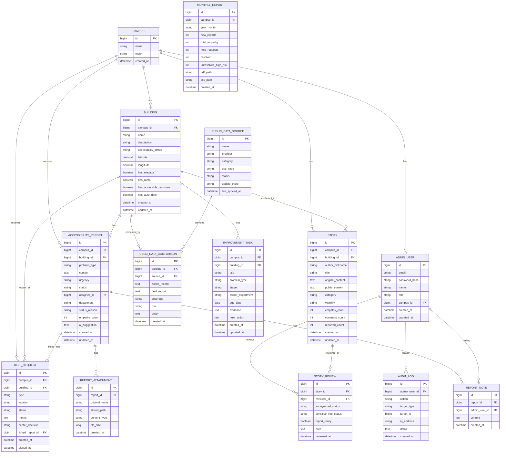

# 베프 관리자 웹 백엔드 설계 초안

현재 관리자 웹은 기본 Mock 모드와 Spring Boot API 연결 모드를 함께 지원합니다. 이 문서는 `src/types.ts`, `src/services/api.ts`, `docs/api-plan.md`를 기준으로 Spring Boot 백엔드 API를 확장하기 위한 설계 초안입니다.

## 1. 설계 요약

베프 관리자 웹의 백엔드는 장애학생의 접근성 제보, 도움 요청, 경험 피드, 공공데이터 참고 정보를 학교/장애학생지원센터가 운영 데이터로 관리할 수 있게 하는 API 서버입니다. 공공데이터와 추천 기능은 최종 판단이 아니라 관리자 검토를 돕는 보조 근거로 둡니다.

1차 MVP에서는 모든 기능을 한 번에 구현하지 않고, 관리자 웹에서 이미 보여주는 화면을 실제 데이터로 바꾸는 데 필요한 최소 도메인부터 구현합니다.

### 1차 MVP 핵심 범위

| 우선순위 | 범위 | 이유 |
|---|---|---|
| 1 | 관리자 인증/인가 | 민감정보, 위치정보, 장애 관련 데이터를 다루므로 선행 필요 |
| 2 | 캠퍼스/건물 조회 | 모든 제보와 분석의 기준 데이터 |
| 3 | 접근성 제보 관리 | 관리자 웹의 핵심 운영 기능 |
| 4 | 도움 요청 관리 | 안전망 기능과 제보 전환 흐름 |
| 5 | 경험 피드 검수 | 특정 가능성 방지용 익명화/공개 상태 관리 |
| 6 | 대시보드 집계 | 공모전 시연과 운영 의사결정에 필요 |
| 7 | 감사 로그 | 관리자 조회/수정 이력 추적 |

PDF/CSV 다운로드 API, 파일 업로드/다운로드, 공공데이터 전체 페이지 수집 endpoint는 Spring Boot MVP에 포함했습니다. AI 실제 연동, 운영 DB 전환, 권한별 인가 고도화는 2차 이후로 두는 편이 현실적입니다.

## 2. 도메인 목록

| 도메인 | 설명 | 프론트 타입/화면 |
|---|---|---|
| AdminUser | 관리자 계정 | `#/settings` |
| AdminRole | 관리자 역할 | `#/settings` |
| Campus | 학교/캠퍼스 | 전체 화면 공통 |
| Building | 건물과 접근성 기본 정보 | `Building`, `#/dashboard`, `#/reports` |
| AccessibilityReport | 접근성 제보 | `AccessibilityReport`, `#/reports` |
| ReportNote | 제보 처리 메모 | `#/reports` |
| ReportAttachment | 제보 사진/첨부파일 | `#/reports` |
| HelpRequest | 긴급 도움 요청 | `HelpRequest`, `#/help-requests` |
| Story | 장애학생 경험 피드 | `Story`, `#/stories` |
| StoryReview | 특정 가능성 방지용 익명화/관리자 검수 | `#/stories` |
| PublicDataSource | 공공데이터 출처 | `PublicDataSource`, `#/public-data` |
| PublicDataComparison | 공공데이터와 현장 제보 비교 결과 | `PublicDataComparison`, `#/public-data` |
| ImprovementTask | 개선 과제 | `ImprovementTask`, `#/workflow` |
| MonthlyReport | 월간 리포트 스냅샷 | `#/monthly-report` |
| AuditLog | 관리자 감사 로그 | `#/settings` |

## 3. ERD 초안



## 4. API 명세 초안

### 공통 응답 형식

```json
{
  "success": true,
  "data": {},
  "message": null
}
```

에러 응답:

```json
{
  "success": false,
  "data": null,
  "message": "요청한 제보를 찾을 수 없습니다.",
  "code": "REPORT_NOT_FOUND"
}
```

### 프론트 14차 API 전환 준비 반영

관리자 웹은 기본 Mock 모드를 유지하면서도 `VITE_API_MODE=http`에서 주요 Spring Boot API를 호출합니다. `src/services/api.ts`에는 다음 Query 타입을 유지합니다.

| 프론트 Query 타입 | 연결 대상 API | 백엔드에서 받을 주요 파라미터 |
|---|---|---|
| `ReportQuery` | `GET /api/admin/reports` | `status`, `urgency`, `assignee`, `buildingId`, `problemType`, `query`, `page`, `size`, `sortBy`, `direction` |
| `HelpRequestQuery` | `GET /api/admin/help-requests` | `status`, `type`, `location`, `unresolvedOnly`, `query`, `page`, `size` |
| `StoryQuery` | `GET /api/admin/stories` | `visibility`, `anonymized`, `sensitiveInfo`, `reportReady`, `query`, `page`, `size` |
| `ImprovementTaskQuery` | `GET /api/admin/improvement-tasks` | `stage`, `owner`, `buildingName`, `query`, `page`, `size` |

백엔드 구현 시 위 Query 계약을 우선 맞추면 프론트의 Mock service를 HTTP client로 교체하기 쉽습니다.

### 인증/관리자

| 기능 | Method | Endpoint | 설명 |
|---|---:|---|---|
| 로그인 | POST | `/api/admin/auth/login` | 관리자 로그인 |
| 내 정보 | GET | `/api/admin/me` | 현재 관리자 프로필 |
| 로그아웃 | POST | `/api/admin/auth/logout` | 세션/JWT 종료 |
| 감사 로그 | GET | `/api/admin/audit-logs` | 관리자 활동 이력 |

### 대시보드

| 기능 | Method | Endpoint | Query |
|---|---:|---|---|
| KPI 조회 | GET | `/api/admin/dashboard` | `campusId`, `from`, `to` |
| 관리자 검토용 추천 | GET | `/api/admin/recommendations` | `campusId` |

### 건물/캠퍼스

| 기능 | Method | Endpoint | 설명 |
|---|---:|---|---|
| 캠퍼스 목록 | GET | `/api/admin/campuses` | 관리자 권한 범위 캠퍼스 |
| 건물 목록 | GET | `/api/admin/campuses/{campusId}/buildings` | 건물 접근성 상태 포함 |
| 건물 상세 | GET | `/api/admin/buildings/{buildingId}` | 제보/공감 집계 포함 |

### 접근성 제보

| 기능 | Method | Endpoint | 설명 |
|---|---:|---|---|
| 제보 목록 | GET | `/api/admin/reports` | 검색/상태/담당자/우선순위 필터 |
| 제보 상세 | GET | `/api/admin/reports/{reportId}` | 원문, 처리 이력, 첨부 포함 |
| 제보 상태 변경 | PATCH | `/api/admin/reports/{reportId}/status` | 상태와 변경 사유 저장 |
| 담당자 배정 | PATCH | `/api/admin/reports/{reportId}/assignee` | 관리자 ID 저장 |
| 우선순위 변경 | PATCH | `/api/admin/reports/{reportId}/priority` | `high`, `mid`, `low` |
| 처리 메모 저장 | POST | `/api/admin/reports/{reportId}/notes` | 관리자 메모 |
| 첨부파일 업로드 | POST | `/api/admin/reports/{reportId}/attachments` | multipart |

제보 상태 변경 요청 예시:

```json
{
  "status": "checking",
  "reason": "현장 확인 필요",
  "department": "시설관리팀"
}
```

### 도움 요청

| 기능 | Method | Endpoint | 설명 |
|---|---:|---|---|
| 도움 요청 목록 | GET | `/api/admin/help-requests` | 위치/유형/상태 검색 |
| 도움 요청 상세 | GET | `/api/admin/help-requests/{requestId}` | 처리 이력 포함 |
| 센터 판단 저장 | PATCH | `/api/admin/help-requests/{requestId}/decision` | 제보 전환 여부 판단 |
| 접근성 제보 연결 | PATCH | `/api/admin/help-requests/{requestId}/linked-report` | 반복 문제 연결 |

### 경험 피드/익명화 검수

| 기능 | Method | Endpoint | 설명 |
|---|---:|---|---|
| 경험 피드 목록 | GET | `/api/admin/stories` | 제목/본문/태그 검색 |
| 경험 피드 상세 | GET | `/api/admin/stories/{storyId}` | 원문/공개본 분리 |
| 공개 상태 변경 | PATCH | `/api/admin/stories/{storyId}/visibility` | `public`, `private`, `center_only` |
| 익명화 요청 | POST | `/api/admin/stories/{storyId}/anonymize` | 소수자 특정 가능성 방지, LLM 연동은 필요성 검토 후 판단 |
| 관리자 검수 저장 | PATCH | `/api/admin/stories/{storyId}/review` | 검수 상태/메모 |

### 공공데이터/반복 분석

| 기능 | Method | Endpoint | 설명 |
|---|---:|---|---|
| 공공데이터 출처 | GET | `/api/admin/public-data/sources` | data.go.kr 등 출처 |
| 비교 결과 | GET | `/api/admin/public-data/comparisons` | 공공데이터와 현장 제보 비교 |
| 반복 문제 분석 | GET | `/api/admin/analysis/repeated-issues` | 건물/문제 유형별 반복 집계 |

### 개선 워크플로우

| 기능 | Method | Endpoint | 설명 |
|---|---:|---|---|
| 개선 과제 목록 | GET | `/api/admin/improvement-tasks` | 단계별 과제 |
| 개선 과제 생성 | POST | `/api/admin/improvement-tasks` | 제보에서 과제 생성 |
| 단계 변경 | PATCH | `/api/admin/improvement-tasks/{taskId}/stage` | 워크플로우 변경 |

### 월간 리포트

| 기능 | Method | Endpoint | 설명 |
|---|---:|---|---|
| 월간 리포트 조회 | GET | `/api/admin/monthly-report` | 집계 스냅샷 |
| PDF 생성 | GET | `/api/admin/monthly-report/export/pdf?yearMonth=YYYY-MM` | 연결 완료 |
| CSV 다운로드 | GET | `/api/admin/monthly-report/export/csv?yearMonth=YYYY-MM` | 1차 연결 |

## 5. Spring Boot 패키지 구조

```text
onda-admin-api/
  src/main/java/com/onda/admin/
    OndaAdminApiApplication.java
    global/
      config/
        SecurityConfig.java
        CorsConfig.java
        JpaAuditingConfig.java
      error/
        GlobalExceptionHandler.java
        ErrorCode.java
        BusinessException.java
      response/
        ApiResponse.java
      security/
        AdminPrincipal.java
        JwtTokenProvider.java
    domain/
      admin/
        controller/
        service/
        repository/
        entity/
        dto/
      campus/
      building/
      report/
      helprequest/
      story/
      publicdata/
      workflow/
      monthlyreport/
      audit/
    infra/
      file/
      ai/
      publicdata/
      reportexport/
  src/main/resources/
    application.yml
    application-local.yml
    application-example.yml
```

## 6. 보안/개인정보 원칙

장애 관련 정보, 위치정보, 경험 피드 원문은 민감도가 높습니다. 1차 MVP라도 아래 원칙은 설계에 포함해야 합니다.

- 관리자 인증 전에는 어떤 관리자 API도 접근 불가
- 역할별 권한 분리
- 경험 피드 원문과 공개본 분리 저장
- 원문 조회는 최소 권한 관리자만 가능
- 관리자 조회/수정/내보내기 감사 로그 저장
- 위치정보는 필요한 기간만 보관
- 첨부파일은 확장자, 용량, MIME 타입 검증
- 에러 응답에 내부 경로, SQL, 스택트레이스 노출 금지
- `.env`, DB 비밀번호, API Key는 GitHub 업로드 금지

## 7. 1차 구현 우선순위

### 1단계: 백엔드 프로젝트 생성

- Spring Boot 3.x
- Java 17 이상
- Spring Web
- Spring Data JPA
- Validation
- Spring Security
- PostgreSQL 또는 MySQL
- Lombok 선택 가능

### 2단계: 기본 도메인과 조회 API

- Campus
- Building
- AccessibilityReport
- HelpRequest
- Story
- AdminUser

우선은 더미 seed 데이터를 DB에 넣고 관리자 웹 Mock 데이터를 API 응답으로 바꾸는 것이 목표입니다.

### 3단계: 관리자 운영 API

- 제보 상태 변경
- 담당자 배정
- 우선순위 변경
- 처리 메모 저장
- 도움 요청 센터 판단 저장
- 경험 피드 공개 상태 변경

### 4단계: 감사 로그

관리자가 수정하는 API에는 전부 감사 로그를 남깁니다.

### 5단계: 리포트/공공데이터/추천

- 월간 리포트 집계
- PDF 생성, CSV 스냅샷/다운로드 이력 고도화
- 공공데이터 배치 동기화는 참고 레이어로 유지
- 익명화 실제 API 연결은 필요성과 보안 검토 후 판단

이 단계는 공모전 MVP 이후로 미뤄도 됩니다.

## 8. 36차 기준 백엔드 MVP 권장 범위

프론트 36차 기준으로는 아래 범위를 백엔드 1차 MVP로 잡는 것이 가장 현실적입니다.

| 단계 | 포함 기능 | 제외 기능 |
|---|---|---|
| 1차 | 관리자 인증/인가, Campus/Building seed, 접근성 제보 조회/상태 변경/담당자/우선순위/메모, 감사 로그 | AI 실제 연동, 운영 DB 전환 |
| 2차 | 도움 요청 조회/상태 변경, 경험 피드 검수/공개 상태, 개선 워크플로우 단계 변경, 파일 업로드/다운로드 | 실시간 push, 파일 검증 고도화 |
| 3차 | 대시보드 집계, 공공데이터 비교/원본/정규화 저장, 월간 리포트 PDF/CSV/스냅샷 | 실내 내비게이션, 이미지 분석 모델 |

첫 API 연결은 `GET /api/admin/reports`부터 시작하는 것을 권장합니다. 이 API가 연결되면 관리자 웹의 핵심 표, 검색, 상세 패널, URL query 재현 흐름을 실제 데이터로 검증할 수 있습니다.

## 9. 구현 전 보안 체크

- 실제 관리자 API는 인증 없이는 열지 않습니다.
- 장애 관련 정보, 위치정보, 경험 피드 원문은 최소 권한 원칙으로 접근시킵니다.
- 수정 API는 모두 `audit_logs`에 관리자, 액션, 대상, 변경 사유, 시각을 기록합니다.
- 실제 LLM 기반 익명화 연결은 필요성과 보안 리뷰를 거친 뒤 진행합니다.
- `.env`, DB 비밀번호, API Key, Oracle credential, wallet은 저장소에 포함하지 않습니다.
